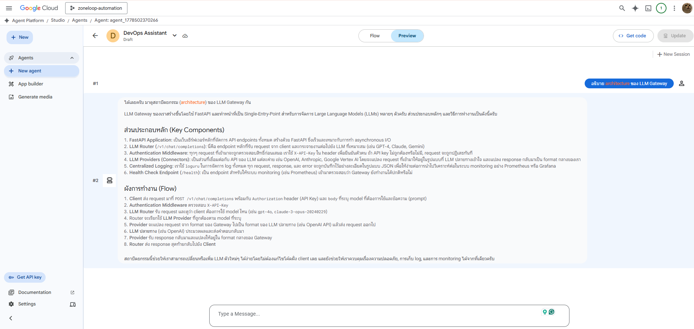
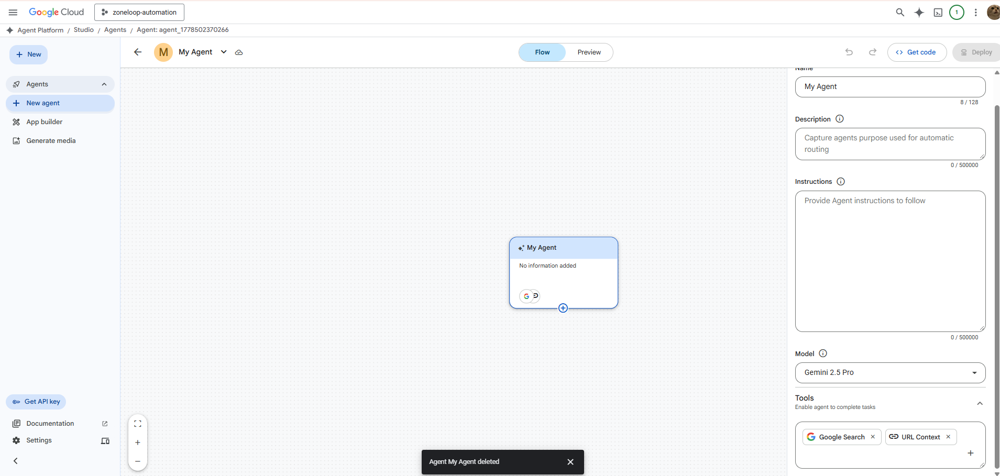
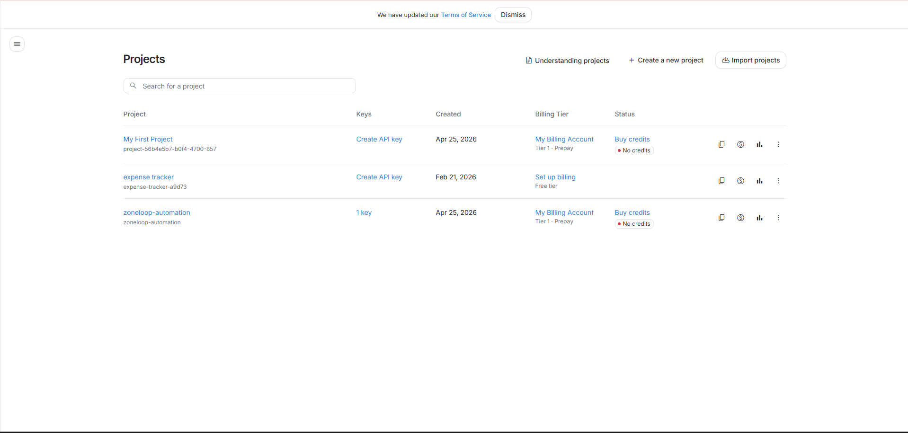

# 🤖 DevOps Assistant Agent

AI-powered DevOps Assistant built on **Google Cloud Agent Builder** with RAG (Retrieval-Augmented Generation) — answers questions about Terraform, Ansible, Docker, CI/CD, and LLMOps using real production code as knowledge base.

[](https://cloud.google.com/products/agent-builder)
[](https://ai.google.dev/)
[](https://cloud.google.com/vertex-ai-search-and-conversation)

## 📸 Demo


*Agent ตอบคำถามเกี่ยวกับ LLM Gateway architecture จาก knowledge base*


*Agent Builder Studio — ตั้งค่า Instructions, Model, และ Data Store*


*Deploy สำเร็จพร้อมใช้งาน*

## 🏗️ Architecture

```
┌─────────────────────────────────────────────────────────────────┐
│                         User (Chat)                              │
│   "เขียน Terraform module สำหรับ VPC แบบ multi-AZ"              │
│   "สร้าง Ansible playbook สำหรับ install Docker"                │
└──────────────────────────────┬──────────────────────────────────┘
                               │
                               ▼
┌──────────────────────────────────────────────────────────────────┐
│              Google Cloud Agent Builder Studio                    │
│                                                                  │
│  Agent: "DevOps Assistant"                                       │
│  ├── Model: Gemini 2.5 Pro                                       │
│  ├── Grounding: Data Store (RAG)                                 │
│  └── Tools: Google Search (fallback)                             │
└──────────────────────────────┬──────────────────────────────────┘
                               │
                               ▼
┌──────────────────────────────────────────────────────────────────┐
│                    Data Store (Knowledge Base)                    │
│                                                                  │
│  📂 llmops-platform-lab/                                         │
│     • LLM Gateway (FastAPI), RAG Pipeline, AI Security           │
│     • Prometheus/Grafana monitoring, Docker Compose              │
│                                                                  │
│  📂 ansible-playbooks/                                           │
│     • setup-docker, deploy-fastapi, setup-monitoring             │
│     • harden-server, Jinja2 templates                            │
│                                                                  │
│  📂 aws-terraform-lab/                                           │
│     • VPC + EC2 + Security Groups + Docker deployment            │
│     • Variables, outputs, user_data bootstrap                    │
└──────────────────────────────────────────────────────────────────┘
```

## 📋 What It Can Do

| Domain | Capabilities |
|--------|-------------|
| **Terraform/AWS** | Explain VPC/EC2 configs, suggest best practices, generate modules |
| **Ansible** | Write playbooks, explain tasks, recommend hardening steps |
| **LLMOps/AI Infra** | Explain RAG pipeline, AI security, prompt guard, gateway routing |
| **Docker/Compose** | Service orchestration, networking, multi-container setups |
| **CI/CD** | GitHub Actions workflows, deployment strategies |
| **Monitoring** | Prometheus configs, Grafana dashboards, alerting rules |

## 🚀 Setup Guide

### Prerequisites

- Google Cloud account with billing enabled
- Project with Agent Builder API activated
- `gcloud` CLI configured

### Step 1: Create Cloud Storage Bucket

```bash
gsutil mb -l us-central1 gs://devops-agent-kb/
gsutil -m cp knowledge-base/* gs://devops-agent-kb/
```

### Step 2: Create Data Store

1. Go to [Agent Builder > Data Stores](https://console.cloud.google.com/gen-app-builder/data-stores)
2. Create Data Store → Cloud Storage → `gs://devops-agent-kb/`
3. Type: **Unstructured documents**
4. Name: `devops-knowledge-base`

### Step 3: Create Agent

1. Go to [Agent Platform Studio](https://console.cloud.google.com/gen-app-builder/agents)
2. Create agent → Name: `DevOps Assistant`
3. Set Instructions (see [`docs/agent-instructions.md`](docs/agent-instructions.md))
4. Add Data Store tool → connect `devops-knowledge-base`
5. Deploy

### Step 4: Test

Use Preview mode and ask:
- "อธิบาย architecture ของ LLM Gateway"
- "เขียน Ansible playbook สำหรับ install Docker"
- "Terraform main.tf สร้าง resource อะไรบ้าง"

## 📁 Project Structure

```
devops-assistant-agent/
├── .github/workflows/ci.yml     # CI: lint markdown + validate structure
├── assets/                      # Screenshots and images
├── docs/
│   ├── agent-instructions.md    # System prompt / Instructions
│   └── architecture.md          # Detailed architecture doc
├── examples/
│   └── query_agent.py           # Python API integration example
├── knowledge-base/              # 28 files for Data Store (RAG)
│   ├── llmops-*.md/txt
│   ├── ansible-*.txt
│   └── terraform-*.txt
├── scripts/
│   └── upload-kb.sh             # Upload knowledge base to GCS
├── .gitignore
├── LICENSE
└── README.md
```

## 💰 Cost

This project uses **GenAI App Builder trial credits** (฿32,504 / ~$900 USD, valid until May 2027). Estimated usage:
- Data Store indexing: minimal
- Agent queries: ~$0.01-0.05 per query
- Google Search grounding: included in credits

## 🔗 Knowledge Base Sources

| Repository | Content |
|-----------|---------|
| [llmops-platform-lab](https://github.com/DerbSwag/llmops-platform-lab) | LLM Gateway, RAG, AI Security, Monitoring |
| [ansible-playbooks](https://github.com/DerbSwag/ansible-playbooks) | Docker, FastAPI, Monitoring, Hardening |
| [aws-terraform-lab](https://github.com/DerbSwag/aws-terraform-lab) | AWS VPC, EC2, Terraform IaC |

## 📝 Part of DevOps + AI Learning Path

This project demonstrates:
- Building RAG-based AI agents on Google Cloud
- Using Vertex AI Search for document grounding
- Integrating DevOps knowledge into conversational AI
- Production-grade agent design with proper instructions

## 📄 License

MIT
