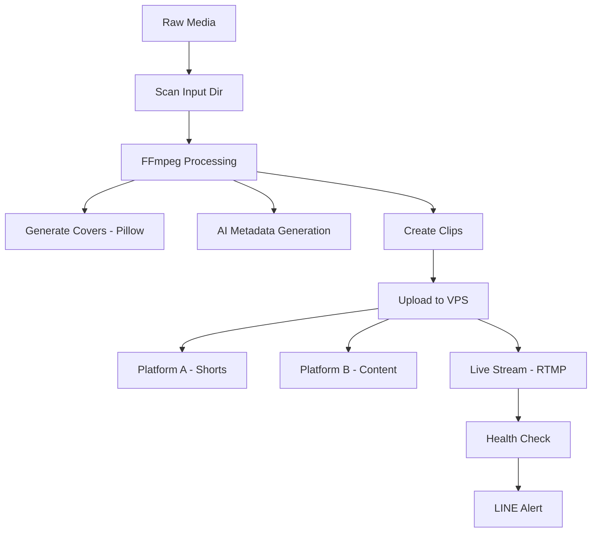

# 🔄 Content Automation Pipeline

End-to-end automation system for content creation, processing, and multi-platform distribution. Handles the full lifecycle from raw media to published content across multiple platforms — fully automated.


## 💡 Problem → Solution

| Before (Manual) | After (Automated) |
|---|---|
| Process each media file individually | **One-command pipeline** processes all files |
| Manually create thumbnails/covers | **Auto-generated** with Python (Pillow) |
| Write metadata for each platform | **AI-generated** titles, descriptions, tags |
| Upload to each platform one by one | **Multi-platform distribution** (API-based) |
| Monitor stream manually | **Health check** with auto-alert via LINE |
| Set up servers from scratch | **VPS provisioning script** — one command |

## 🏗️ Architecture

```
Raw Media
    │
    ▼
┌─────────────────────────────────────────────┐
│              PIPELINE (pipeline.py)          │
│                                              │
│  1. Scan input directory                     │
│  2. Process media (FFmpeg)                   │
│  3. Generate covers (Pillow)                 │
│  4. Generate metadata (AI)                   │
│  5. Create clips (multiple formats)          │
│  6. Upload to VPS                            │
│  7. Distribute to platforms                  │
└─────────────────────────────────────────────┘
    │
    ├──► Platform A (Shorts API)
    ├──► Platform B (Content API)
    └──► Live Stream (RTMP + FFmpeg)
              │
              └──► Health Check → LINE Alert
```




## 📁 Project Structure

```
content-automation-pipeline/
├── pipeline/
│   ├── pipeline.py              # Main orchestrator — runs full pipeline
│   └── meta_gen.py              # Auto-generate titles, descriptions, tags
├── media-processing/
│   ├── cover_art_gen.py         # Generate cover art (3000x3000 + thumbnails)
│   ├── longform_mix.sh          # FFmpeg: concat audio + overlay on video
│   └── clip_gen.sh              # Generate short clips from long content
├── distribution/
│   ├── autostream.py            # 24/7 live stream automation (FFmpeg + RTMP)
│   ├── upload_tiktok.py         # TikTok Content Posting API uploader
│   └── upload_shorts.py         # YouTube Shorts API uploader (scheduled)
├── monitoring/
│   └── health_check.sh          # Stream health monitor + LINE Notify alert
├── infra/
│   ├── setup_vps.sh             # VPS provisioning (Docker, FFmpeg, Python)
│   └── stream.sh                # Stream launcher with logging
├── config.example.json
└── .gitignore
```

## ⚙️ Modules

### 🎯 Pipeline Orchestrator (`pipeline/pipeline.py`)
- Scans input directory for new media
- Runs processing → metadata → cover art → upload in sequence
- Configurable via JSON config
- Supports batch processing

### 🖼️ Media Processing (`media-processing/`)
- **cover_art_gen.py** — Generate cover art (3000x3000 for distribution + 1280x720 thumbnails) using Pillow
- **longform_mix.sh** — FFmpeg pipeline: concat audio tracks + overlay on background video
- **clip_gen.sh** — Extract short clips with multiple camera angles/crops

### 📡 Distribution (`distribution/`)
- **autostream.py** — 24/7 live stream via FFmpeg + RTMP with auto-restart on failure
- **upload_tiktok.py** — TikTok Content Posting API with OAuth2 token management
- **upload_shorts.py** — YouTube Data API v3 with scheduled publishing from JSON

### 📊 Monitoring (`monitoring/`)
- **health_check.sh** — Check stream status via API, alert via LINE Notify if down

### 🖥️ Infrastructure (`infra/`)
- **setup_vps.sh** — Provision Ubuntu VPS: install Docker, FFmpeg, Python, systemd service
- **stream.sh** — Launch stream with logging and auto-restart

## 🚀 Quick Start

```bash
# 1. Configure
cp config.example.json config.json
# Edit with your settings

# 2. Run full pipeline
python pipeline/pipeline.py

# 3. Start live stream
bash infra/stream.sh

# 4. Monitor
bash monitoring/health_check.sh
```

## 🛠️ Tech Stack

| Tool | Usage |
|------|-------|
| **Python 3** | Pipeline orchestration, API integration, image generation |
| **Bash** | Media processing, server provisioning, stream management |
| **FFmpeg** | Audio/video processing, streaming, clip generation |
| **Pillow** | Cover art and thumbnail generation |
| **YouTube Data API v3** | Shorts upload with scheduling |
| **TikTok Content Posting API** | Auto-upload with OAuth2 |
| **LINE Notify API** | Health check alerts |
| **Google Cloud VPS** | 24/7 stream hosting |

## 🔒 Security

- No API keys or tokens in code
- All secrets in `config.json` (gitignored)
- SSH key-based VPS access only

## 📄 License

MIT
