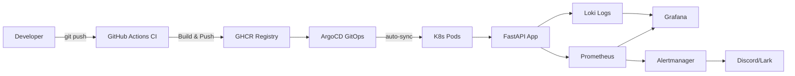

# DevOps FastAPI Lab 🚀

A production-style DevOps lab using FastAPI, Docker, Kubernetes, and a full monitoring stack with automated CI/CD pipeline and GitOps.

---

## Architecture

### Full System Diagram

```
Developer Workflow:
  git push --> GitHub Actions (CI) --> Build image --> GHCR
                                                       |
                                             ArgoCD (GitOps CD)
                                                       |
                                             auto-sync --> K8s pods

  +---- Home Lab (k3s 1-node) ----+   +---- Company Lab (k3s 3-node / Proxmox) ----+
  | FastAPI (Helm)                |   | FastAPI (Helm)                              |
  | ArgoCD (auto-sync+self-heal)  |   | ArgoCD (auto-sync)                          |
  | cert-manager (TLS)            |   | Zabbix v7.0 (14 hosts)                      |
  |                               |   |                                              |
  | Monitoring:                   |   | Monitoring:                                  |
  |   Prometheus + Grafana        |   |   Prometheus + Grafana                       |
  |   Loki (log aggregation)      |   |   Alertmanager --> Lark                      |
  |   Alertmanager --> Discord    |   |   Zabbix SNMP (K8s, Windows, CCTV)           |
  +-------------------------------+   +----------------------------------------------+

  +---- Perimeter ---------------------------------------------------------+
  | FortiGate 60F -- VPN / NAT / VLAN segmentation / Firewall policy       |
  +------------------------------------------------------------------------+
```

### CI/CD Pipeline Flow

```
git push --> GitHub Actions --> Build Docker image --> Push to GHCR
                                                         |
         Docker Compose (Home Lab)          ArgoCD detects Helm drift
                  |                                       |
         FastAPI + Nginx running             auto-sync --> K8s pods updated
                                            (zero-downtime rolling update)
```

### Monitoring & Observability

```
Application --> Prometheus --> Grafana (dashboards)
                    |
K8s Nodes ----> Alertmanager --> Discord / Lark (alerts)

App Logs -----> Loki ----------> Grafana (log search)
```




## Tech Stack

| Category | Tools |
|----------|-------|
| Application | FastAPI, Python |
| Containerization | Docker, Docker Compose |
| Container Registry | GitHub Container Registry (GHCR) |
| Orchestration | Kubernetes (k3s), Helm |
| GitOps | ArgoCD |
| Ingress | Nginx Ingress Controller |
| Reverse Proxy | Nginx, Traefik |
| Monitoring | Prometheus, Grafana, Node Exporter, cAdvisor |
| Alerting | Alertmanager → Discord |
| CI/CD | GitHub Actions + Self-hosted Runner |
| Version Control | Git, GitHub |

---

## Project Structure

```
.
├── app/                    # FastAPI application
│   ├── main.py
│   └── requirements.txt
├── docker/
│   └── Dockerfile
├── compose/
│   ├── app.yml
│   └── monitoring.yml
├── monitoring/
│   ├── prometheus/
│   │   ├── prometheus.yml
│   │   └── alerts.yml
│   ├── grafana/
│   └── alertmanager/
│       └── alertmanager.yml
├── k8s/
│   ├── level4-ingress-hpa/     ← Level 4 (Ingress + TLS + HPA)
│   │   ├── cluster-issuer.yaml
│   │   ├── fastapi-ingress-tls.yaml
│   │   ├── monitoring-ingress.yaml
│   │   └── hpa.yaml
│   ├── level5-statefulset/     ← Level 5 (StatefulSet + RBAC)
│   │   ├── configmap.yaml
│   │   ├── secret.yaml
│   │   ├── fastapi/
│   │   ├── postgres/
│   │   ├── rbac/
│   │   └── helm/
│   ├── level8-loki/            ← Level 8 (Loki logging)
│   │   └── loki-values.yaml
│   └── rbac/
├── helm/
│   └── fastapi/
│       ├── Chart.yaml
│       ├── values.yaml
│       ├── values/
│       └── templates/
├── nginx/
│   └── my-api.conf
├── scripts/
│   ├── setup.sh
│   └── deploy.sh
└── .github/workflows/
    └── docker.yml
```

---

## Prerequisites

Before getting started, ensure the following are installed:

- Docker + Docker Compose
- kubectl
- k3s (single-node Kubernetes)
- Helm 3
- ArgoCD CLI (optional)

---

## Learning Roadmap

### ✅ Level 1 — Docker & CI/CD
- FastAPI containerized with Docker
- Docker Compose for multi-service stack
- GitHub Actions CI/CD pipeline
- Auto-deploy via self-hosted runner
- Image pushed to GHCR

### ✅ Level 2 — Kubernetes & Helm
- k3s single-node cluster setup
- FastAPI deployed via Helm chart
- ConfigMap & Secrets management
- Service types: ClusterIP / NodePort

### ✅ Level 3 — GitOps & Monitoring
- ArgoCD installed on k3s
- Auto-sync from `helm/fastapi/` on main branch
- Self-heal enabled
- Prometheus + Grafana + Alertmanager stack
- 5 alert rules → Discord notifications

### ✅ Level 4 — Advanced Kubernetes
- Nginx Ingress Controller — expose services via domain instead of NodePort
- NetworkPolicy — pod-level firewall, restrict traffic to ingress-nginx namespace only
- HPA — auto-scale FastAPI pods 1→5 replicas based on CPU utilization (50%)

### ✅ Level 5 — StatefulSet, RBAC & Multi-env Helm
- PostgreSQL via StatefulSet + PersistentVolume (2Gi)
- ConfigMap & Secret management for DB credentials
- RBAC — namespace-scoped Role + RoleBinding for FastAPI service account
- Helm multi-environment deploy (dev / prod) with separate values files

### ✅ Level 6 — Ingress + TLS
- Nginx Ingress Controller + cert-manager for domain-based routing
- Self-signed ClusterIssuer for HTTPS termination
- Multi-service ingress (FastAPI, Grafana, Prometheus, Alertmanager)

| Domain | Service |
|--------|---------|
| fastapi.lab | FastAPI App (HTTPS) |
| grafana.lab | Grafana Dashboard |
| prometheus.lab | Prometheus |
| alertmanager.lab | Alertmanager |

### ✅ Level 7 — HPA Stress Test
- Auto-scaling FastAPI pods based on CPU load
- Stress test result: 199% CPU spike → scaled from 1 → 6 pods automatically

| Setting | Value |
|---------|-------|
| Min Replicas | 1 |
| Max Replicas | 10 |
| Target CPU | 50% |

### ✅ Level 8 — Loki Logging Stack
- Loki-stack Classic (single binary) deployed in `monitoring` namespace
- Promtail log collection from all pods
- Grafana datasource integration

---

## CI/CD Pipeline

Every push to `main` triggers:

1. Build Docker image
2. Push image → `ghcr.io/derbswag/devops-api:latest` + `:<git-sha>`
3. Self-hosted runner deploys via Docker Compose
4. ArgoCD detects Helm changes → sync to Kubernetes

---

## GitOps with ArgoCD

ArgoCD monitors `helm/fastapi/` and auto-syncs to Kubernetes:

```bash
# Check sync status
kubectl get application -n argocd

# Access ArgoCD UI
kubectl port-forward svc/argocd-server -n argocd 8888:443 --address 0.0.0.0
# https://<VM_IP>:8888
```

---

## Getting Started

### 1. Clone repository

```bash
git clone https://github.com/DerbSwag/Devops-fastapi-lab.git
cd Devops-fastapi-lab
```

### 2. Configure secrets

```bash
cp .env.example .env
# Set DISCORD_WEBHOOK_URL in .env — never commit real values
```

### 3. Run Application (Docker)

```bash
docker compose -f compose/app.yml up -d
docker compose -f compose/monitoring.yml up -d
```

### 4. Deploy to Kubernetes (Helm)

```bash
export KUBECONFIG=/etc/rancher/k3s/k3s.yaml
helm install fastapi helm/fastapi/
```

### 5. Apply Level 4 configs (Ingress + HPA)

```bash
kubectl apply -f k8s/level4-ingress-hpa/cluster-issuer.yaml
kubectl apply -f k8s/level4-ingress-hpa/fastapi-ingress-tls.yaml
kubectl apply -f k8s/level4-ingress-hpa/monitoring-ingress.yaml
kubectl apply -f k8s/level4-ingress-hpa/hpa.yaml
```

### 6. Deploy Level 5 (StatefulSet + RBAC)

```bash
# Create secrets first (never commit real values)
kubectl create secret generic fastapi-secret \
  --from-literal=DB_USER=postgres \
  --from-literal=DB_PASSWORD=yourpassword \
  --from-literal=SECRET_KEY=yoursecretkey \
  -n level5

kubectl apply -f k8s/level5-statefulset/configmap.yaml
kubectl apply -f k8s/level5-statefulset/rbac/
kubectl apply -f k8s/level5-statefulset/postgres/
kubectl apply -f k8s/level5-statefulset/fastapi/
```

### 7. Helm multi-environment deploy

```bash
# Dev (NodePort 32010)
helm upgrade --install fastapi-dev ./helm/fastapi \
  -f helm/values/values-dev.yaml -n level5-dev --create-namespace

# Prod (NodePort 32011)
helm upgrade --install fastapi-prod ./helm/fastapi \
  -f helm/values/values-prod.yaml -n level5-prod --create-namespace
```

### 8. Install Ingress + TLS (Level 6)

```bash
helm install ingress-nginx ingress-nginx/ingress-nginx \
  --namespace ingress-nginx --create-namespace \
  --set controller.service.type=NodePort \
  --set controller.service.nodePorts.http=30080 \
  --set controller.service.nodePorts.https=30443

helm install cert-manager jetstack/cert-manager \
  --namespace cert-manager --create-namespace \
  --set crds.enabled=true

kubectl apply -f k8s/level4-ingress-hpa/cluster-issuer.yaml
kubectl apply -f k8s/level4-ingress-hpa/fastapi-ingress-tls.yaml
kubectl apply -f k8s/level4-ingress-hpa/monitoring-ingress.yaml
```

### 9. Deploy Loki Logging Stack (Level 8)

```bash
helm repo add grafana https://grafana.github.io/helm-charts
helm repo update

helm upgrade --install loki-stack grafana/loki-stack \
  -n monitoring --create-namespace \
  -f k8s/level8-loki/loki-values.yaml
```

---

## Level 4 — Ingress, NetworkPolicy, HPA

### Ingress Controller

```bash
# Access via domain (add to /etc/hosts: <VM_IP> fastapi.local)
curl -H "Host: fastapi.local" http://<VM_IP>:30080/
```

### HPA

```bash
kubectl apply -f k8s/level4-ingress-hpa/hpa.yaml

# Monitor scaling
watch "kubectl get hpa && kubectl top pods"
```

---

## Service URLs

| Service | URL |
|---------|-----|
| FastAPI (Docker) | http://localhost:8000 |
| FastAPI (K8s - Ingress) | http://fastapi.local:30080 |
| FastAPI (K8s - NodePort) | http://\<VM_IP\>:32010 |
| Prometheus | http://localhost:9090 |
| Grafana | http://localhost:3000 |
| Alertmanager | http://localhost:9093 |
| ArgoCD | https://\<VM_IP\>:8888 |

> **Note:** All URLs above are for local lab use only. Do not expose these ports to the internet without proper authentication.

---

## Monitoring & Alerting

### Alert Rules

| Alert | Condition | Severity |
|-------|-----------|----------|
| HighCPUUsage | CPU > 80% for 1m | warning |
| HighMemoryUsage | RAM > 85% for 1m | warning |
| DiskSpaceLow | Disk > 80% for 1m | critical |
| InstanceDown | Service down for 1m | critical |
| ContainerHighCPU | Container CPU > 80% | warning |

Alerts are sent to Discord via Alertmanager webhook (configured via `DISCORD_WEBHOOK_URL` environment variable).

### Grafana

```
URL:      http://localhost:3000
Username: admin
Password: admin  ← change this for any non-local environment
```

---

## Security Notes

- Discord webhook URL is loaded from environment variable, never hardcoded
- Kubernetes secrets are created via `kubectl create secret` — template files use placeholder values only
- Real secret files (`*secret-real.yaml`, `*.env`) are excluded via `.gitignore`

---

## License

MIT License# CI/CD test trigger 2026-05-05 14:34
