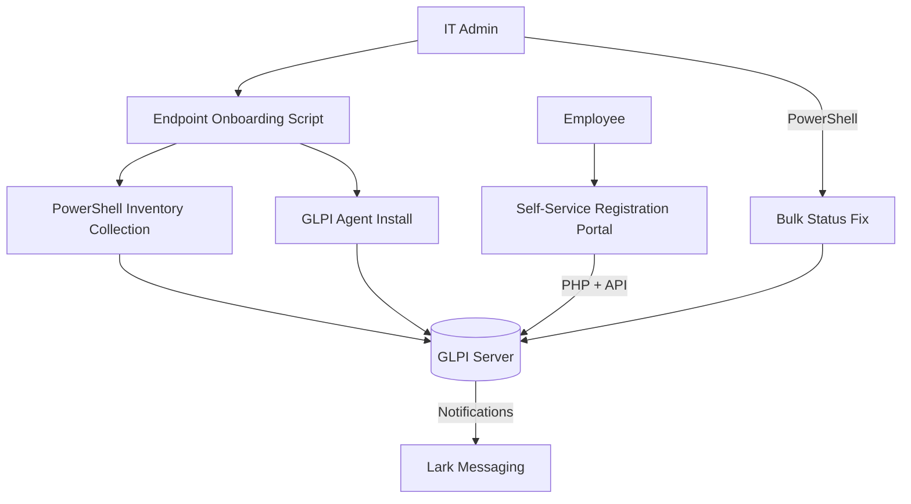

# 🖥 Windows IT Automation Toolkit

[](https://github.com/DerbSwag/IT-Automation-Toolkit/actions/workflows/ci.yml)


Production-oriented Windows automation toolkit for endpoint onboarding, inventory collection, GLPI asset management, and Lark integration.

> 💼 **Real-world project** — Built and used daily by a sole IT engineer managing 100+ users in a manufacturing facility. Not a tutorial — this runs in production.


## 💡 Problem → Solution → Impact

| | Before (Manual) | After (Automated) |
|---|---|---|
| **Endpoint onboarding** | ~45 min/device — manual install, inventory, registration | **~5 min/device** — one-click script |
| **Inventory collection** | Walk to each PC, manually record specs | **Run remotely** — PowerShell auto-collects |
| **GLPI registration** | Manually create user + assign device in UI | **Self-service portal** — employees register themselves |
| **Department groups** | Create 25+ groups one-by-one | **One script** — all groups with hierarchy in seconds |
| **Device status updates** | Click through UI for each device | **Bulk update** — PowerShell fixes all at once |

> **Total time saved: ~3+ hours/week** on routine IT operations

---


## 🚀 Overview

This toolkit automates repetitive IT operations in a manufacturing environment (100+ users):

- **Endpoint inventory** — Collect hardware/software info via PowerShell
- **GLPI Agent deployment** — Silent install with network validation
- **GLPI API automation** — Create groups, fix statuses, register devices
- **Web registration** — Self-service device registration portal
- **Lark integration** — Bridge GLPI alerts to Lark messaging
- **Portable orchestration** — One-click endpoint onboarding with admin elevation





---

## 📁 Project Structure

```text
IT-Automation-Toolkit/
├── config/
│   └── toolkit.ini                     # Centralized configuration
├── glpi/
│   ├── install_glpi.bat                # GLPI Agent installer (production)
│   ├── Install_GLPI_Agent.bat          # GLPI Agent installer v2 (download + install)
│   ├── config.ini                      # Legacy config reference
│   ├── glpi_config.ini.example         # Config template (copy & fill your tokens)
│   ├── scripts/
│   │   ├── Create-GLPIGroups.ps1       # Create department groups via GLPI API
│   │   ├── Fix-StatusAndGroup.ps1      # Bulk fix device status & group assignment
│   │   └── Link-LarkToGLPI.ps1        # Bridge GLPI notifications → Lark
│   └── web/
│       ├── index.html                  # Device registration UI
│       └── register.php                # Registration backend (GLPI API)
├── inventory/
│   ├── Get-PCInfo.ps1                  # PowerShell inventory collector
│   └── inventory.bat                   # Runner with admin elevation + logging
├── portable/
│   └── endpoint_toolkit.bat            # One-click orchestration script
├── docs/
│   ├── architecture.md
│   ├── workflow.md
│   └── network-diagram.md
├── .github/workflows/ci.yml           # CI: file validation + PS syntax check
├── .gitignore
└── LICENSE (MIT)
```

---

## ⚙️ Modules

### 📦 Inventory Collection (`inventory/`)

Collects endpoint hardware and software information.

```
inventory.bat → elevates to admin → runs Get-PCInfo.ps1 → saves output
```

- Hostname, OS, CPU, RAM, disk, network adapters
- Installed software list
- Output to timestamped file

### 🔧 GLPI Agent Deployment (`glpi/`)

Silent deployment of GLPI Agent with pre-flight checks.

**Which script to use:**

| Script | Use When |
|--------|----------|
| `Install_GLPI_Agent.bat` | **Recommended** — Downloads MSI via HTTP, verifies SHA256, installs silently |
| `install_glpi.bat` | Legacy — Uses MSI from local network share |
| `IT_PJ_Inventory.bat` | All-in-one — Inventory + GLPI install in a single run |

> `install_glpi.bat` is kept for environments without HTTP download. For new deployments, prefer `Install_GLPI_Agent.bat`.


```
Install_GLPI_Agent.bat → ping server → download MSI → silent install → trigger inventory
```

- Network reachability validation before install
- Configurable server URL and MSI path
- Error handling with logging

### 📡 GLPI API Scripts (`glpi/scripts/`)

PowerShell scripts that automate GLPI management via REST API.

| Script | Function |
|--------|----------|
| `Create-GLPIGroups.ps1` | Create department groups (top-level + sub-groups) with parent-child hierarchy |
| `Fix-StatusAndGroup.ps1` | Bulk update device status and group assignment |
| `Link-LarkToGLPI.ps1` | Read GLPI data and push notifications to Lark messaging |

All scripts read credentials from `glpi_config.ini` — no hardcoded tokens.

### 🌐 Web Registration (`glpi/web/`)

Self-service device registration portal for end users.

- `index.html` — Clean UI for employees to register their devices
- `register.php` — Backend that creates users + assigns computers via GLPI API
- Auto-detects VLAN and selects appropriate API token

### 🚀 Portable Orchestration (`portable/`)

One-click endpoint onboarding script.

```
endpoint_toolkit.bat → validate config → elevate admin → inventory → GLPI install
```

---

## 🔧 Configuration

### Main Config (`config/toolkit.ini`)

```ini
[GLPI]
SERVER_URL=http://glpi.example.local/glpi/front/inventory.php
MSI_NAME=GLPI-Agent.msi
PING_HOST=glpi.example.local

[INVENTORY]
OUTPUT_DIR=..\output\inventory
INVENTORY_SCRIPT=..\inventory\Get-PCInfo.ps1

[LOGGING]
LOG_DIR=..\logs
LOG_FILE=toolkit.log
```

### GLPI API Config (`glpi/glpi_config.ini.example`)

```ini
[GLPI]
SERVER_URL=http://YOUR_SERVER_IP
USER_TOKEN=YOUR_USER_TOKEN

[APP_TOKENS]
VLAN1=YOUR_APP_TOKEN_VLAN1
VLAN2=YOUR_APP_TOKEN_VLAN2
```

> Copy `glpi_config.ini.example` → `glpi_config.ini` and fill in your actual values.

---

## 🔒 Security

- ✅ No hardcoded credentials — all tokens in config files (gitignored)
- ✅ `.ini.example` provided as template
- ✅ Restrict execution to authorized IT administrators
- ✅ All sensitive data sanitized before commit

## ✅ CI / Validation

GitHub Actions workflow validates on every push:
- Required file presence
- PowerShell script syntax parsing
- Credential leak detection (blocks commits with real tokens)
- Pester test suite execution

## Tests

Run Pester tests locally:

```powershell
Invoke-Pester tests/ -Verbose
```

Tests cover:
- `Read-IniFile` - INI parsing, missing file handling, empty values
- `Get-PCInfo` - stdout output, file output, hostname detection

## 📄 License

MIT License — see [LICENSE](LICENSE)
